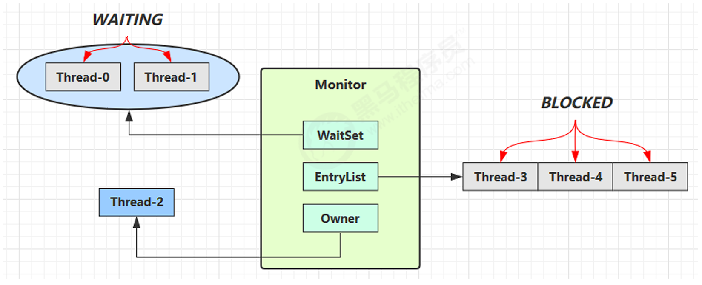
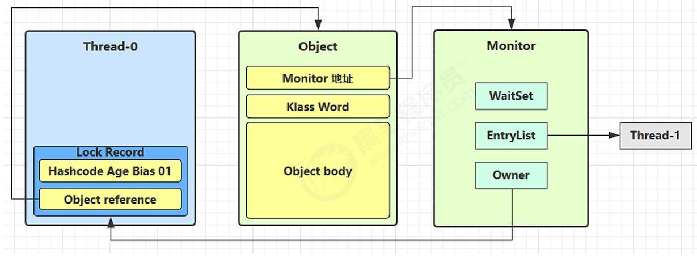
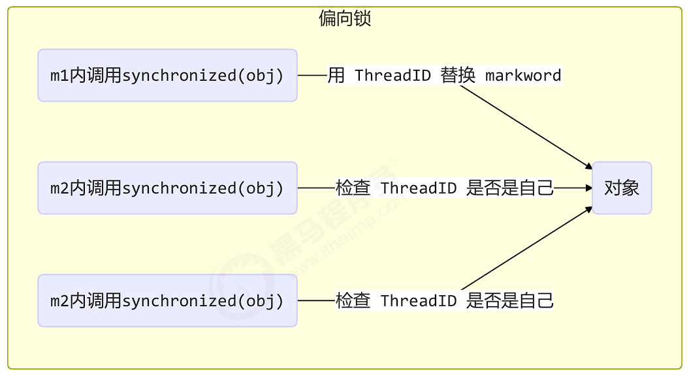
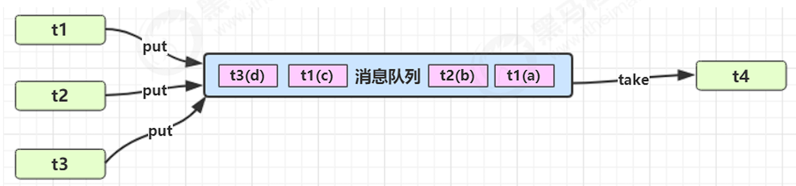
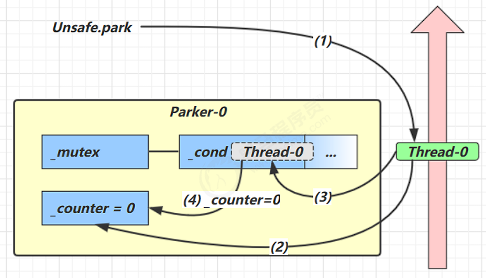

# 概览

## 整体内容


## 预备知识

- 线程安全问题，接触过 Java Web 开发、Jdbc 开发、Web 服务器、分布式框架
- 基于 JDK 8，最好对函数式编程、lambda 有一定了解 
- 采用了 slf4j 打印日志，这是好的实践 采用了 
- lombok 简化 java bean 编写 
- 给每个线程好名字，这也是一项好的实践


demo依赖

```xml
<properties>
 	<maven.compiler.source>1.8</maven.compiler.source>
 	<maven.compiler.target>1.8</maven.compiler.target>
</properties>

<dependencies>
     <dependency>
 	 	<groupId>org.projectlombok</groupId>
 	 	<artifactId>lombok</artifactId>
 	 	<version>1.18.10</version>
 	</dependency>
 	<dependency>
 		<groupId>ch.qos.logback</groupId>
 		<artifactId>logback-classic</artifactId>
 		<version>1.2.3</version>
 	</dependency>
 </dependencies>
```


logback配置

```xml
<?xml version="1.0" encoding="UTF-8"?>
<configuration>
    <statusListener class="ch.qos.logback.core.status.NopStatusListener"/> <!-- 禁用logback内部日志  -->

    <property name="pattern" value="%d{HH:mm:ss} [%thread] %-5level %logger{50} - %msg %n"/>
    <property name="pattern-color"
              value="%yellow(|%d{HH:mm:ss}|) [%thread] %highlight(%-5level) %green(%logger{50}) - %highlight(%msg) %n"/>

    <!-- 控制台输出 -->
    <appender name="CONSOLE" class="ch.qos.logback.core.ConsoleAppender">
        <encoder class="ch.qos.logback.classic.encoder.PatternLayoutEncoder">
            <pattern>${pattern}</pattern>
        </encoder>
    </appender>

    <!-- 控制台输出-带颜色 -->
    <appender name="CONSOLE-WITH-COLOR" class="ch.qos.logback.core.ConsoleAppender">
        <encoder class="ch.qos.logback.classic.encoder.PatternLayoutEncoder">
            <pattern>${pattern-color}</pattern>
        </encoder>
    </appender>

    <root level="INFO">
        <appender-ref ref="CONSOLE-WITH-COLOR"/>
    </root>
</configuration>
```


# 进程与线程

## 进程与线程

### 进程

- 程序由指令和数据组成，但这些指令要运行，数据要读写，就必须将指令加载至 CPU，数据加载至内存。在 指令运行过程中还需要用到磁盘、网络等设备。进程就是用来加载指令、管理内存、管理 IO 的
- 当一个程序被运行，从磁盘加载这个程序的代码至内存，这时就开启了一个进程。 
- 进程就可以视为程序的一个实例。大部分程序可以同时运行多个实例进程（例如记事本、画图、浏览器 等），也有的程序只能启动一个实例进程（例如网易云音乐、360 安全卫士等）


### 线程

- 一个进程之内可以分为一到多个线程。 
- 一个线程就是一个指令流，将指令流中的一条条指令以一定的顺序交给 CPU 执行 
- Java 中，线程作为最小调度单位，进程作为资源分配的最小单位。 
- 在 windows 中进程是不活动的，只是作 为线程的容器


### 对比

- 进程基本上相互独立的，而线程存在于进程内，是进程的一个子集 
- 进程拥有共享的资源，如内存空间等，供其内部的线程共享 
- 进程间通信较为复杂 
  - 同一台计算机的进程通信称为 IPC（Inter-process communication） 
  - 不同计算机之间的进程通信，需要通过网络，并遵守共同的协议，例如 HTTP 
- 线程通信相对简单，因为它们共享进程内的内存，一个例子是多个线程可以访问同一个共享变量 
- 线程更轻量，线程上下文切换成本一般上要比进程上下文切换低


## 并行与并发

单核 cpu 下，线程实际还是 **串行执行** 的。操作系统中有一个组件叫做任务调度器，将 cpu 的时间片（windows 下时间片最小约为 15 毫秒）分给不同的程序使用，只是由于 cpu 在线程间（时间片很短）的切换非常快，人类感 觉是 同时运行的 。

> [!NOTE]
>
> 总结为一句话就是：**微观串行，宏观并行**， 一般会将这种线程轮流使用CPU的做法称为并发， `concurrent`


引用 Rob Pike 的一段描述： 

- 并发（concurrent）是同一时间应对（dealing with）多件事情的能力 
- 并行（parallel）是同一时间动手做（doing）多件事情的能力


## 应用


### 异步调用

以调用方角度来讲，如果 

- 需要等待结果返回，才能继续运行就是同步 
- 不需要等待结果返回，就能继续运行就是异步


多线程可以让方法执行变为异步的（即不要巴巴干等着）比如说读取磁盘文件时，假设读取操作花费了 5 秒钟，如 果没有线程调度机制，这 5 秒 cpu 什么都做不了，其它代码都得暂停... 

**应用案例**

- 比如在项目中，视频文件需要转换格式等操作比较费时，这时开一个新线程处理视频转换，避免阻塞主线程 
- tomcat 的异步 servlet 也是类似的目的，让用户线程处理耗时较长的操作，避免阻塞 tomcat 的工作线程 
- ui 程序中，开线程进行其他操作，避免阻塞 ui 线程


### 提高效率

充分利用多核 cpu 的优势，提高运行效率。想象下面的场景，执行 3 个计算，最后将计算结果汇总。 

```
计算 1 花费 10 ms 
计算 2 花费 11 ms 
计算 3 花费 9 ms 
汇总需要 1 ms
```

如果是串行执行，那么总共花费的时间是  10 + 11 + 9 + 1 = 31ms 

但如果是四核 cpu，各个核心分别使用线程 1 执行计算 1，线程 2 执行计算 2，线程 3 执行计算 3，那么 3 个 线程是并行的，花费时间只取决于最长的那个线程运行的时间，即 11ms ,加上汇总是 12ms 

> [!CAUTION]
>
>  需要在多核 cpu 才能提高效率，单核仍然时是轮流执行


1. 单核 cpu 下，多线程不能实际提高程序运行效率，只是为了能够在不同的任务之间切换，不同线程轮流使用 cpu ，不至于一个线程总占用 cpu，别的线程没法干活 
2. 多核 cpu 可以并行跑多个线程，但能否提高程序运行效率还是要分情况的 
   - 有些任务，经过精心设计，将任务拆分，并行执行，当然可以提高程序的运行效率。
   - 但不是所有计算任 务都能拆分（参考后文的【阿姆达尔定律】） 也不是所有任务都需要拆分，任务的目的如果不同，谈拆分和效率没啥意义 
3. IO 操作不占用 cpu，只是我们一般拷贝文件使用的是【阻塞 IO】，这时相当于线程虽然不用 cpu，但需要一 直等待 IO 结束，没能充分利用线程。所以才有后面的【非阻塞 IO】和【异步 IO】优化


---

# Java线程


## 创建和启动线程


### Thread匿名类

```java
        // 创建线程对象
        Thread t = new Thread(){
            @Override
            public void run() {
                // 线程执行的代码
                log.info("Running...");
            }
        };
        // 启动线程
        t.start();
```

> [!TIP]
>
> j建议为线程指定名字
>
> 可以通过线程对象的 `setName(String name)` 方法为线程指定名字


### Runnable（推荐）

```java
        Runnable r = new Runnable() {
            @Override
            public void run() {
                // 需要执行的任务
                log.info("Running...");
            }
        };

        Thread t2 = new Thread(r, "Test2");
        t2.start();
```

> [!TIP]
>
> 可使用lambda表达式
>
> ```java
>         Runnable r = () -> log.info("Running...");
> ```


**原理解析**

Thread中的run 方法：

```java
    @Override
    public void run() {
        if (target != null) {
            target.run();
        }
    }
```

- Thread匿名类重写了该方法，实现任务执行
- Runnable会被赋值给target变量，然后执行其中的任务


### FutureTask

FutureTask 能够接收 Callable 类型的参数，用来处理有返回结果的情况

```java
        // 创建任务对象
        FutureTask<Integer> task = new FutureTask<>(() -> {
            log.info("Running...");
            Thread.sleep(2000);
            return 200;
        });
        
        // 创建线程对象
        Thread t = new Thread(task);
        t.start();
        log.info("Waiting...");
        log.debug("Result: {}", task.get());
```


输出

```
03-29 13:51:18 [main] INFO  com.ysh.Test - Start 
03-29 13:51:18 [main] INFO  com.ysh.Test - Waiting... 
03-29 13:51:18 [Thread-0] INFO  com.ysh.Test - Running... 
03-29 13:51:20 [main] DEBUG com.ysh.Test - Result: 200 
03-29 13:51:20 [main] INFO  com.ysh.Test - End
```


### 查看进程线程

**windows**  

- 任务管理器可以查看进程和线程数，也可以用来杀死进程 

- `tasklist` 查看进程 

- `taskkill` 杀死进程 

  

**linux**  

- `ps -fe` 查看所有进程 

- `ps -fT -p`  查看某个进程（PID）的所有线程 

- `kill ` 杀死进程 

- `top` 按大写 H 切换是否显示线程 

- `top -H -p`  查看某个进程（PID）的所有线程 

  

**Java**  

- `jps` 命令查看所有 Java 进程 
- `jstack`  查看某个 Java 进程（PID）的所有线程状态  
- `jconsole` 来查看某个 Java 进程中线程的运行情况（图形界面）


jconsole 远程监控配置 

需要以如下方式运行你的 java 类 

```bash
java -Djava.rmi.server.hostname=`ip地址` -Dcom.sun.management.jmxremote  Dcom.sun.management.jmxremote.port=`连接端口` -Dcom.sun.management.jmxremote.ssl=是否安全连接  Dcom.sun.management.jmxremote.authenticate=是否认证  java类
```

- 修改 /etc/hosts 文件将 127.0.0.1 映射至主机名 
- 如果要认证访问，还需要做如下步骤 
  - 复制 jmxremote.password 文件 
  - 修改 jmxremote.password 和 jmxremote.access 文件的权限为 600 即文件所有者可读写 
  - 连接时填入 controlRole（用户名），R&D（密码）


## 线程原理

### 栈与栈帧

Java Virtual Machine Stacks （Java 虚拟机栈）

JVM 内存有堆、栈、方法区，栈会为每一个线程分配一块栈内存。

- 每个栈由多个栈帧组成，对应每次方法调用
- 每个线程只能有一个活动栈帧，对应当前正在执行的方法


### 线程上下文切换(Thread Context Switch)

引起线程切换的情况：

- 线程的CPU时间片使用完
- JVM进行垃圾回收
- 有更高优先级的线程需要运行
- 线程调用了 sleep、yield、wait、join、park、synchronized、lock等方法


当 `Context Switch` 发生时，需要由操作系统保存当前线程的状态，并恢复另一个线程的状态，Java 中对应的概念 就是程序计数器（Program Counter Register），它的作用是记住下一条 jvm 指令的执行地址，是线程私有的

- 状态包括程序计数器、虚拟机栈中每个栈帧的信息，如局部变量、操作数栈、返回地址等 
- Context Switch 频繁发生会影响性能


## 常见方法

| 方法名          | 功能                                    | 注意                                                         |
| --------------- | --------------------------------------- | ------------------------------------------------------------ |
| start()         | 启动一个线程                            | start 方法只是让线程进入就绪，里面代码不一定立刻运行，<font color=red>只能调用一次</font> |
| run()           | 线程启动后会执行的方法                  |                                                              |
| join()          | 等待线程运行结束                        |                                                              |
| join(long n)    | 等待线程运行结 束,最多等待 n  毫秒      |                                                              |
| getId()         | 获取线程ID                              | ID唯一                                                       |
| getName()       | 获取线程名                              |                                                              |
| setName()       | 修改线程名                              |                                                              |
| setPriority()   | 修改线程优先级                          | java中规定线程优先级是1~10 的整数，较大的优先级 能提高该线程被 CPU 调度的机率 |
| getPriority()   | 获取线程优先级                          |                                                              |
| getState()      | 获取线程状态                            | Java 中线程状态是用 6 个 enum 表示，分别为： NEW, RUNNABLE, BLOCKED, WAITING,  TIMED_WAITING, TERMINATED |
| isAlive()       | 线程是否存活（还没有执行完）            |                                                              |
| isInterrupted() | 判断线程是否被打断                      | 不会清除 **打断标记**                                        |
| interrupt()     | 打断线程                                | 如果被打断线程正在 sleep，wait，join 会导致被打断 的线程抛出 `InterruptedException`，并清除打断标记，如果打断的正在运行的线程，则会设置 打断标记，park 的线程被打断，也会设置打断标记 |
| interrupted()   | 打断线程                                | 静态方法，会清除 **打断标记**                                |
| currentThread() | 获取当前正在执行的线程                  | 静态方法                                                     |
| sleep(long n)   | 使线程休眠                              | 静态方法                                                     |
| yield()         | 提示线程调度器 让出当前线程对 CPU的使用 | 静态方法                                                     |


### run() 和 start()

- 直接调用`run()`方法，实际上任由main线程执行，并不会创建新线程。
- 而调用`start()`方法，会新建线程，并由新线程执行`run()`方法


> [!CAUTION]
>
> `start()`方法每个线程对象只能调用一次，再次调用会抛出异常


### sleep() 和 yield()

**sleep**

- 调用 sleep 会让当前线程从 Running  进入 Timed Waiting 状态（阻塞）

- 其它线程可以使用  interrupt 方法打断正在睡眠的线程，这时 sleep 方法会抛出 `InterruptedException`

- 睡眠结束后的线程未必会立刻得到执行

- 建议用 `TimeUnit` 的 sleep 代替 Thread 的 sleep 来获得更好的可读性

  ```java
          try {
              // 当前线程休眠1秒
              TimeUnit.SECONDS.sleep(1);
          } catch (InterruptedException e) {
              e.printStackTrace();
          }
  ```


**yield**

- 调用 yield 会让当前线程从 Running 进入 Runnable  就绪状态，然后调度执行其它线程
- 具体的实现依赖于操作系统的任务调度器


#### 案例

​	防止 CPU 100%占用：

线程不需要执行任务时，不要让`while(true)`空转占用 CPU ，应该使用`yield`或者`sleep`让出 CPU 资源


### 线程优先级

- 线程优先级会提示（hint）调度器优先调度该线程，但它**仅仅是一个提示，调度器可以忽略它**
- 如果 cpu 比较忙，那么优先级高的线程会获得更多的时间片，但 cpu 空闲时，优先级几乎没作用


### join

如下代码，主线程打印出 r 的值为 0，因为主线程并不会等待t1线程运行完后才打印

```java
static int r = 0;
public static void main(String[] args) throws InterruptedException {
    test1();
}
private static void test1() throws InterruptedException {
    log.debug("开始");
    Thread t1 = new Thread(() -> {
        log.debug("开始");
        sleep(1);
        log.debug("结束");
        r = 10;
    });
    t1.start();
    log.debug("结果为:{}", r);
    log.debug("结束");
}
```

在 `t1.start()` 之后调用 `t1.join()`，主线程则会等待 t1 执行结束


#### 线程同步

如果调用方

- 需要等待结果返回，才能继续运行就是同步
- 不需要等待结果返回，就能继续运行就是异步


使用 join 等待其他线程运行的结果


> [!TIP]
>
> 带参数的`join`方法会等待指定时间，如果线程执行时间小于等待时间，`join`会提前结束，如果等待时间小于线程执行时间，会在到达等待时间后结束。


### interrupt

1. **打断 sleep，wait，join 的线程**

这几个方法都会让线程进入阻塞状态

打断 sleep 的线程, 会清空打断状态（调用isInterrupted()返回的boolean值）


打断正常运行的线程

```java
        Thread t1 = new Thread(() -> {
            while (true) {
                boolean interrupted = Thread.currentThread().isInterrupted();
                if (interrupted) {
                    log.info("Thread1 interrupted");
                    break;
                }
                log.info("Thread1 running");
            }
        });

        t1.start();

        TimeUnit.SECONDS.sleep(1);

        t1.interrupt();
```


#### 设计模式-两阶段终止


```java
    private Thread monitor;

    public void start() {
        monitor = new Thread(() -> {
            while (true) {
                Thread current = Thread.currentThread();
                if (current.isInterrupted()) {
                    log.info("被打断，处理中...");
                    break;
                }

                try {
                    Thread.sleep(1000);
                    log.info("监控中...");
                } catch (InterruptedException e) {
                    // 重新设置中断状态
                    current.interrupt();
                }
            }
            log.info("监控结束");
        });
        monitor.start();
    }

    public void stop() {
        monitor.interrupt();
    }
```

> [!WARNING]
>
> 由于线程可能在slepp时被打断，而此时打断标记会被置为false，所以需要重新设置打断标记


#### 打断park线程

打断park线程，不会清空打断状态

```java
public void stop() {
            monitor.interrupt();
        }
        Thread t1 = new Thread(() -> {
            log.debug("park...");
            LockSupport.park();
            log.debug("unpark...");
            log.debug("打断状态：{}", Thread.currentThread().isInterrupted());
        },
                "t1");
        t1.start();
        sleep(0.5);
        t1.interrupt();
```

输出打断状态为 true


> [!CAUTION]
>
> 如果在park之前打断标记已经是true，那么park时会失效


### 不推荐的方法

如下方法容易破坏同步代码块，造成死锁，JDK以不推荐使用

| 方法      | 功能             |
| --------- | ---------------- |
| stop()    | 停止线程         |
| suspend() | 挂起（暂停）线程 |
| resume()  | 恢复线程运行     |


##  守护线程

默认情况下，Java 进程需要等待所有线程都运行结束，才会结束。有一种特殊的线程叫做守护线程，只要其它非守护线程运行结束了，即使守护线程的代码没有执行完，也会强制结束。


如下方法可将线程设置为守护线程

```java
    public final void setDaemon(boolean on)
```


> [!Note]
>
> - 垃圾回收器线程就是一种守护线程 
> - Tomcat 中的 Acceptor 和 Poller 线程都是守护线程，所以 Tomcat 接收到 shutdown 命令后，不会等待它们处理完当前请求


## 线程状态

从 **操作系统** 层面来描述线程状态


- 【初始状态】仅是在语言层面创建了线程对象，还未与操作系统线程关联 
- 【可运行状态】（就绪状态）指该线程已经被创建（与操作系统线程关联），可以由 CPU 调度执行 
- 【运行状态】指获取了 CPU 时间片运行中的状态 
  - 当 CPU 时间片用完，会从【运行状态】转换至【可运行状态】，会导致线程的上下文切换 
- 【阻塞状态】 
  - 如果调用了阻塞 API，如 BIO 读写文件，这时该线程实际不会用到 CPU，会导致线程上下文切换，进入 【阻塞状态】 
  - 等 BIO 操作完毕，会由操作系统唤醒阻塞的线程，转换至【可运行状态】 
  - 与【可运行状态】的区别是，对【阻塞状态】的线程来说只要它们一直不唤醒，调度器就一直不会考虑 调度它们 
- 【终止状态】表示线程已经执行完毕，生命周期已经结束，不会再转换为其它状态


### 六种状态

从 **Java API** 层面来描述

`Thread.State` 枚举，分为六种状态


- `NEW`  线程刚被创建，但是还没有调用  start() 方法 
- `RUNNABLE` 当调用了  start() 方法之后，注意，Java API 层面的  RUNNABLE 状态涵盖了 操作系统 层面的 【可运行状态】、【运行状态】和【阻塞状态】（由于 BIO 导致的线程阻塞，在 Java 里无法区分，仍然认为 是可运行） 
- `BLOCKED` ， `WAITING` ， 详述 `TIMED_WAITING` 都是 Java API 层面对【阻塞状态】的细分，后面会在状态转换一节 
- `TERMINATED` 当线程代码运行结束


# 共享模型

## 线程安全问题

```java
        static int count = 0;
		Thread t1 = new Thread(() -> {
            for (int i = 0; i < 10000; i++) {
                count++;
            }
        });

        Thread t2 = new Thread(() -> {
            for (int i = 0; i < 10000; i++) {
                count++;
            }
        });

        t1.start();
        t2.start();

        t1.join();
        t2.join();
        
        System.out.println(count);
```

> [!Caution]
>
> 以上代码输出的值 count < 20000
>
> 多个线程同时访问修改同一个变量就可能发生线程安全问题


### 临界区

- 一个程序运行多个线程本身是没有问题的
- 问题出在多个线程访问共享资源
  - 多个线程读共享资源其实也没有问题
  - 在多个线程对共享资源读写操作时发生指令交错，就会出现问题
- 一段代码块内如果存在对共享资源的多线程读写操作，称这段代码块为**临界区**

```java
    static int counter = 0;

    static void increment()
    // 临界区
    {
        counter++;
    }

    static void decrement()
    // 临界区
    {
        counter--;
    }
```


## synchronized

为了避免临界区的竞态条件发生，有多种手段可以达到目的。 

- 阻塞式的解决方案：`synchronized`，`Lock`
- 非阻塞式的解决方案：原子变量


### `synchronized`对象锁

语法

```java
    synchronized(对象) // 线程1， 线程2(blocked)
    {
        临界区
    }
```


示例

```java
        private static int count = 0;
    	private static final Object lock = new Object();// 锁对象

		Thread t1 = new Thread(() -> {
            for (int i = 0; i < 10000; i++) {
                synchronized (lock) {
                    count++;
                }
            }
        });

        Thread t2 = new Thread(() -> {
            for (int i = 0; i < 10000; i++) {
                synchronized (lock) {
                    count--;
                }
            }
        });

        t1.start();
        t2.start();

        t1.join();
        t2.join();

        System.out.println(count);
```

> [!Important]
>
> synchronized 实际是用对象锁保证了临界区内代码的**原子性**，临界区内的代码对外是不可分割的，不会被线程切换所打断。


封装线程安全对象

```java
class Room {
    private int count = 0;
    
    public void encrement() {
        // 以自身为锁对象
        synchronized (this) {
            count++;
        }
    }
    
    public void decrment() {
        synchronized (this) {
            count--;
        }
    }
    
    public int getCount() {
        synchronized (this) {
            return count;
        }
    }
}
```


### 方法上的`synchronized`

```java
class Room {
    private int count = 0;

    public synchronized void encrement() {
        count++;
    }

    public synchronized void decrment() {
        count--;
    }

    public synchronized int getCount() {
        return count;
    }
}
```

> [!Tip]
>
> 等同于在方法体内使用
>
> ```
> synchronized (this) {
> 	...
> }
> ```


> [!Important]
>
> `synchronized`使用在静态方法前，相当于对类的**class对象**加锁


## 线程安全分析

### 成员变量和静态变量

- 如果它们没有共享，则线程安全 
- 如果它们被共享了，根据它们的状态是否能够改变，又分两种情况 
  - 如果只有读操作，则线程安全 
  - 如果有读写操作，则这段代码是临界区，需要考虑线程安全


### 局部变量

- 局部变量是线程安全的 

> [!Tip]
>
> 局部变量存放在虚拟机栈的局部变量表中，每个线程都有自己的栈，线程之间不共享

- 但局部变量引用的对象则未必 
  - 如果该对象没有逃离方法的作用访问，它是线程安全的 
  - 如果该对象逃离方法的作用范围，需要考虑线程安全

```java
class ThreadSafe {
    public void method1(int loopNumber) {
        ArrayList<String> list = new ArrayList<>();
        for (int i = 0; i < loopNumber; i++) {
            method2(list);
            method3(list);
        }
    }
    public void method2(ArrayList<String> list) {
        list.add("1");
    }
    public void method3(ArrayList<String> list) {
        list.remove(0);
    }
}
class ThreadSafeSubClass extends ThreadSafe{
    @Override
    public void method3(ArrayList<String> list) {
        // 产生线程安全问题
        new Thread(() -> {
            list.remove(0);
        }).start();
    }
}
```

> [!Tip]
>
> 可将方法2和3使用private修饰，防止子类重写，使用final修饰方法1防止子类重写


### 常见线程安全类

多个线程调用它们**同一个实例的某个方法**时，是线程安全的

- `String`
- `Integer` 
- `StringBuffer `
- `Random `
- `Vector `
- `Hashtable `
- `java.util.concurrent` 包下的类

> [!Warning]
>
> 它们的每个方法是原子的
>
> 但注意它们多个**方法的组合不是原子的**

```java
Hashtable table = new Hashtable();
 // 线程1 get，线程2 put
 if( table.get("key") == null) {
    table.put("key", value);
 }
```


> [!Note]
>
> `String`、`Integer` 等都是不可变类，因为其内部的状态不可以改变，因此它们的方法都是线程安全的


示例解析

- 例1

```java
public class MyServlet extends HttpServlet {
    // 不安全
    Map<String, Object> map = new HashMap<>();
    // 不可变类，安全
    String S1 = "...";
    // 安全
    final String S2 = "...";
    // 不安全
    Date D1 = new Date();
    // 不安全，Date引用不可变，但是Date的内容可变
    final Date D2 = new Date();

    public void doGet(HttpServletRequest request, HttpServletResponse response) {
        // 使用上述变量
    }
}
```


- 例2

```java
public class MyServlet extends HttpServlet {
    // 不安全，原因是UserServiceImpl存在不安全的成员变量
    private UserService userService = new UserServiceImpl();
    public void doGet(HttpServletRequest request, HttpServletResponse response) {
        userService.update(...);
    }
}
public class UserServiceImpl implements UserService {
    // 记录调用次数
    private int count = 0;
    public void update() {
        // ...
        count++;
    }
}
```


- 例3

```java
@Aspect
@Component
public class MyAspect {
    // 不安全，建议使用环绕通知将start变成局部变量
    private long start = 0L;

    @Before("execution(* *(..))")
    public void before() {
        start = System.nanoTime();
    }

    @After("execution(* *(..))")
    public void after() {
        long end = System.nanoTime();
        System.out.println("cost time:" + (end - start));
    }
}
```


- 例4

```java
public class MyServlet extends HttpServlet {
    // 安全
    private UserService userService = new UserServiceImpl();
    public void doGet(HttpServletRequest request, HttpServletResponse response) {
        userService.update(...);
    }
}
public class UserServiceImpl implements UserService {
    // 安全
    private UserDao userDao = new UserDaoImpl();
    public void update() {
        userDao.update();
    }
}
public class UserDaoImpl implements UserDao {
    public void update() {
        // 安全
        String sql = "update user set password = ? where username = ?";
        try (Connection conn = DriverManager.getConnection("", "", "")) {
            // ...
        } catch (Exception e) {
        }
    }
}
```


- 例5

```java
public class MyServlet extends HttpServlet {
    // 不安全
    private UserService userService = new UserServiceImpl();
    public void doGet(HttpServletRequest request, HttpServletResponse response) {
        userService.update(...);
    }
}
public class UserServiceImpl implements UserService {
    // 不安全
    private UserDao userDao = new UserDaoImpl();
    public void update() {
        userDao.update();
    }
}
public class UserDaoImpl implements UserDao {
    // 不安全，线程可共享conn，一个线程关闭连接后其他线程无法获得conn
    private Connection conn = null;
    public void update() throws SQLException {
        String sql = "update user set password = ? where username = ?";
        conn = DriverManager.getConnection("","","");
        // ...
        conn.close();
    }
}
```


- 例6

```java
public class MyServlet extends HttpServlet {
    // 安全
    private UserService userService = new UserServiceImpl();
    public void doGet(HttpServletRequest request, HttpServletResponse response) {
        userService.update(...);
    }
}
public class UserServiceImpl implements UserService {
    // 安全，不同线程使用不同的UserDaoImpl对象，无法共享内部不安全的connection变量
    public void update() {
        UserDao userDao = new UserDaoImpl();
        userDao.update();
    }
}
public class UserDaoImpl implements UserDao {
    // 不安全
    private Connection = null;
    public void update() throws SQLException {
        String sql = "update user set password = ? where username = ?";
        conn = DriverManager.getConnection("","","");
        // ...
        conn.close();
    }
}
```


- 例7

```java
public abstract class Test {
    public void bar() {
        // 不安全
        SimpleDateFormat sdf = new SimpleDateFormat("yyyy-MM-dd HH:mm:ss");
        foo(sdf);
    }
    // 子类实现该方法，并将SimpleDateFormat共享至不同的线程中
    public abstract foo(SimpleDateFormat sdf);
    public static void main(String[] args) {
        new Test().bar();
    }
}
```


## Monitor

Java 对象头中的 `Mark Word` 标记字段，用于标记对象的状态


Monitor 被翻译为监视器或管程 

每个 Java 对象都可以关联一个 Monitor 对象，如果使用 synchronized 给对象上锁（重量级锁）之后，该对象头的 Mark Word 中就被设置指向 Monitor 对象的指针



- 刚开始 Monitor 中 Owner 为 null 
- 当 Thread-2 执行 synchronized(obj) 就会将 Monitor 的所有者 Owner 置为 Thread-2，Monitor中只能有一 个 Owner 
- 在 Thread-2 上锁的过程中，如果 Thread-3，Thread-4，Thread-5 也来执行 synchronized(obj)，就会进入  EntryList BLOCKED 
- Thread-2 执行完同步代码块的内容，然后唤醒 EntryList 中等待的线程来竞争锁，竞争的时是非公平的
-  WaitSet 中的 Thread-0，Thread-1 是之前获得过锁，但条件不满足进入 WAITING 状态的线程


## synchronized 优化原理进阶

### 轻量级锁

轻量级锁的使用场景：如果一个对象虽然有多线程要加锁，但加锁的时间是错开的（也就是没有竞争），那么可以 使用轻量级锁来优化。

轻量级锁对使用者是透明的，即语法仍然是  `synchronized`


例如以下代码：

```java

static final Object obj = new Object();
public static void method1() {
    synchronized( obj ) {
        // 同步块 A
        method2();
    }
}
public static void method2() {
    synchronized( obj ) {
        // 同步块 B
    }
}
```


- 创建锁记录（Lock Record）对象，每个线程的栈帧都会包含一个锁记录的结构，内部可以存储锁定对象的  Mark Word


- 让锁记录中 Object reference 指向锁对象，并尝试用 cas 替换 Object 的 Mark Word，将 Mark Word 的值存 入锁记录
- 如果 cas 替换成功，对象头中存储了 锁记录地址和状态 00 ，表示由该线程给对象加锁

- 如果 cas 失败，有两种情况 
  - 如果是其它线程已经持有了该 Object 的轻量级锁，这时表明有竞争，进入锁膨胀过程 
  - 如果是自己执行了 synchronized **锁重入**，那么再添加一条 Lock Record 作为重入的计数
- 当退出 synchronized 代码块（解锁时）如果有取值为 null 的锁记录，表示有重入，这时重置锁记录，表示重 入计数减一
- 当退出 synchronized 代码块（解锁时）锁记录的值不为 null，这时使用 cas 将 Mark Word 的值恢复给对象 头 
  - 成功，则解锁成功 
  - 失败，说明轻量级锁进行了锁膨胀或已经升级为重量级锁，进入重量级锁解锁流程


### 锁膨胀

如果在尝试加轻量级锁的过程中，CAS 操作无法成功，这时一种情况就是有其它线程为此对象加上了轻量级锁（有竞争），这时需要进行锁膨胀，将轻量级锁变为重量级锁。


过程如下：

- 当 Thread-1 进行轻量级加锁时，Thread-0 已经对该对象加了轻量级锁
- 这时 Thread-1 加轻量级锁失败，进入锁膨胀流程 
  - 即为 Object 对象申请 Monitor 锁，让 Object 指向重量级锁地址 
  - 然后自己进入 Monitor 的 EntryList BLOCKED
- 当 Thread-0 退出同步块解锁时，使用 CAS 将 Mark Word 的值恢复给对象头，失败。这时会进入重量级解锁 流程，即按照 Monitor 地址找到 Monitor 对象，设置 Owner 为 null，唤醒 EntryList 中 BLOCKED 线程




### 自旋优化

重量级锁竞争的时候，可以使用自旋来进行优化，如果当前线程自旋成功（即这时候持锁线程已经退出了同步 块，释放了锁），当前线程就可以避免阻塞。


- 自旋会占用 CPU 时间，<font color=red>单核 CPU 自旋就是浪费，多核 CPU 自旋才能发挥优势</font>。 
- 在 Java 6 之后自旋锁是自适应的，比如对象刚刚的一次自旋操作成功过，那么认为这次自旋成功的可能性会 高，就多自旋几次；反之，就少自旋甚至不自旋。
- Java 7 之后不能控制是否开启自旋功能。


### 偏向锁

轻量级锁在没有竞争时（无其他线程需要与其竞争锁对象），每次重入仍然需要执行 CAS 操作。

> [!Note]
>
> Java 6 中引入了**偏向锁**来做进一步优化：
>
> 偏向锁是JVM为了提高同步性能而设计的一种锁优化机制。它基于"大多数情况下锁不存在竞争"的假设，让锁偏向于第一个获取它的线程。
>
> 只有第一次使用 CAS 将线程 ID 设置到对象的 Mark Word 头，之后发现这个线程 ID 是自己的就表示没有竞争，不用重新 CAS。以后只要不发生竞争，这个对象就归该线程所有




#### 偏向状态

对象头(64 bit) Mark Word 状态：


一个对象创建时：

- 如果开启了偏向锁（默认开启），那么对象创建后，`markword` 值为 `0x05` 即最后 3 位为 101，这时它的  thread、epoch、age 都为 0
- 偏向锁是默认是延迟的，不会在程序启动时立即生效，如果想避免延迟，可以使用虚拟机参数  `-XX:BiasedLockingStartupDelay=0` 来禁用延迟
- 如果没有开启偏向锁，那么对象创建后，`markword` 值为 `0x01` 即最后 3 位为 001，这时它的 `hashcode`、 age 都为 0，第一次用到 `hashcode` 时才会赋值

> [!Tip]
>
> JVM 参数 
>
> `-XX:-UseBiasedLocking` 禁用偏向锁
>
> `-XX:+UseBiasedLocking` 启用偏向锁（默认）


#### 撤销-调用对象的 `hashCode`

偏向锁的对象 MarkWord 中存储的是线程 id，如果调用 hashCode 会导致偏向锁被 撤销

> [!Tip]
>
> 由于长度限制，对象头中不能同时存储 线程ID 和 hashCode

- 轻量级锁会在锁记录中记录 hashCode 
- 重量级锁会在 Monitor 中记录 hashCode

#### 撤销-其他线程使用对象

当有其它线程使用偏向锁对象时，会将偏向锁升级为轻量级锁

#### 撤销-调用 `wait/notify`


#### 批量重偏向

​	当偏向锁的假设不成立(即存在多个线程竞争锁)时，JVM需要撤销偏向锁。如果频繁发生偏向锁撤销，会影响性能。批量重偏向就是为了解决这个问题。


1. 当某个类的偏向锁撤销次数达到阈值(默认20次)时，JVM会认为这个类的锁不适合使用偏向模式
2. JVM会执行批量重偏向，将这个类的所有实例的偏向锁状态重置
3. 之后这些实例的锁可以重新偏向于新的线程，而不是直接升级为轻量级锁


#### 批量撤销

批量撤销是JVM在检测到某个类的偏向锁频繁发生竞争时，**彻底禁用该类的偏向锁优化**的机制。如果撤销次数增长到40次，就会触发**批量撤销**。


### 锁消除

锁消除是JVM在**即时编译（JIT）阶段**进行的一种锁优化技术，它通过**逃逸分析（Escape Analysis）检测某些同步代码是否真的需要加锁，如果JVM确定锁对象不会发生竞争**，就会直接**移除锁操作**，从而提升性能。


JVM在运行时会进行**逃逸分析**，判断对象是否可能被多个线程访问：

- **不逃逸（No Escape）**：对象仅在当前方法或线程内使用，不会被其他线程访问。
- **方法逃逸（Method Escape）**：对象可能被其他方法访问，但仍限于当前线程。
- **线程逃逸（Thread Escape）**：对象可能被其他线程访问（需要同步）。

如果JVM发现某个锁对象**不会逃逸到其他线程**（即不存在真正的竞争），就会**直接消除锁**，减少同步开销。


例如：单线程环境下**StringBuffer 会被替换成 StringBuilder**


## wait/notify


- Owner 线程发现条件不满足，调用 wait 方法，即可进入 WaitSet 变为 WAITING 状态 
- BLOCKED 和 WAITING 的线程都处于阻塞状态，不占用 CPU 时间片 
- BLOCKED 线程会在 Owner 线程释放锁时唤醒 
- WAITING 线程会在 Owner 线程调用 notify 或 notifyAll 时唤醒，但唤醒后并不意味者立刻获得锁，仍需进入  EntryList 重新竞争


| 方法              | 作用                   | 说明                                                         |
| :---------------- | :--------------------- | :----------------------------------------------------------- |
| **`wait()`**      | 让当前线程进入等待状态 | 释放锁，进入等待队列，直到被 `notify()`/`notifyAll()` 唤醒或超时 |
| **`notify()`**    | 随机唤醒一个等待线程   | 从等待队列中选择一个线程唤醒（不保证公平性）                 |
| **`notifyAll()`** | 唤醒所有等待线程       | 所有等待线程竞争锁，只有一个能继续执行                       |

> [!Caution]
>
> 它们必须在 `synchronized` 代码块或方法中使用
>
> 调用 `wait()/notify()` 前，线程必须持有该对象的锁，否则会抛出 `IllegalMonitorStateException`。


**`wait()` 和 `sleep()` 的区别**

| **`wait()`**                   | **`sleep()`**                |
| :----------------------------- | :--------------------------- |
| 释放锁                         | 不释放锁                     |
| 属于 `Object` 类               | 属于 `Thread` 类             |
| 必须和 `synchronized` 一起使用 | 可以在任何地方调用           |
| 可被 `notify()` 唤醒           | 只能等时间到或 `interrupt()` |
| 线程状态 TIMED_WAITING         | 线程状态 TIMED_WAITING       |


### 虚假唤醒

虚假唤醒是指线程在没有收到明确通知的情况下从等待状态中被唤醒的现象。


为了防止虚假唤醒导致的问题，最佳实践是：

1. 总是在循环中检查条件，而不是简单的if语句
2. 使用while循环而不是if来检查条件变量


示例代码

```java
// 不安全的写法 - 可能因虚假唤醒导致问题
synchronized(lock) {
    if(!condition) {
        lock.wait();
    }
    // 执行操作
}

// 正确的写法 - 防止虚假唤醒
synchronized(lock) {
    while(!condition) {  // 使用while循环
        lock.wait();
    }
    // 执行操作
}
```


### 保护性暂停

保护性暂停是一种多线程设计模式，用于当一个线程需要等待某个条件满足后才能继续执行的情况。


保护性暂停模式的核心思想是：

- **保护条件**：线程执行前必须满足的条件
- **暂停机制**：当条件不满足时，线程主动暂停执行
- **恢复机制**：当条件满足时，线程被唤醒继续执行


示例代码

```java
public class GuardedObject {
    private Object response;
    
    /**
     * 获取结果
     * @param timeout 超时时间
     * @return 结果
     */
    public Object get(long timeout){
        synchronized(this) {
            long remaining = timeout;
            long endTime = System.currentTimeMillis() + timeout;

            while(response == null && remaining > 0) {
                try {
                    this.wait(remaining);
                } catch (InterruptedException e) {
                    Thread.currentThread().interrupt();
                    throw new RuntimeException(e);
                }
                // 虚假唤醒时剩余等待时间
                remaining = endTime - System.currentTimeMillis();
            }
            return response;
        }
    }
    
    public void complete(Object response) {
        synchronized(this) {
            this.response = response;
            this.notifyAll();
        }
    }
}
```

> [!Note]
>
> `join()`底层就是通过该方式实现的


### 生产者消费者模式

- 与前面的保护性暂停中的 GuardObject 不同，不需要产生结果和消费结果的线程一一对应 
- 消费队列可以用来平衡生产和消费的线程资源 
- 生产者仅负责产生结果数据，不关心数据该如何处理，而消费者专心处理结果数据 
- 消息队列是有容量限制的，满时不会再加入数据，空时不会再消耗数据 
- JDK 中各种阻塞队列，采用的就是这种模式



示例代码

```java
@Slf4j
public class TestMessageQueue {

    public static void main(String[] args) throws InterruptedException {
        MessageQueue queue = new MessageQueue(2);

        for (int i = 0; i < 3; i++) {
            int id = i;
            new Thread(() -> {
                log.info("生产者{}开始生产消息", id);
                queue.put(new Message(id, "消息" + id));
            }, "生产者" + i).start();
        }

        Thread.sleep(1000);

        new Thread(() -> {
            while (true) {
                try {
                    Thread.sleep(500);
                } catch (InterruptedException e) {
                    throw new RuntimeException(e);
                }
                Message msg = queue.take();
                log.info("消费者开始消费消息：{}", msg.getValue());
            }
        }, "消费者").start();
    }

}

@Slf4j
class MessageQueue {

    /**
     * 队列容量
     */
    private final int capacity;

    /**
     * 消息队列
     */
    private final LinkedList<Message> list;

    public MessageQueue(int capacity) {
        this.capacity = capacity;
        list = new LinkedList<>();
    }

    /**
     * 获取消息
     * @return 消息
     */
    public Message take() {
        synchronized (list) {
            // 队列为空，等待生产者生产
            while (list.isEmpty()) {
                log.info("队列为空，等待生产者生产");
                try {
                    list.wait();
                } catch (InterruptedException e) {
                    throw new RuntimeException(e);
                }
            }
            Message message = list.removeFirst();
            list.notifyAll();
            return message;
        }
    }

    /**
     * 放入消息
     * @param message 消息
     */
    public void put(Message message) {
        synchronized (list) {
            // 队列已满，等待消费者消费
            while (list.size() == capacity) {
                log.info("队列已满，等待消费者消费");
                try {
                    list.wait();
                } catch (InterruptedException e) {
                    throw new RuntimeException(e);
                }
            }
            list.addLast(message);
            list.notifyAll();
        }
    }

}

@Getter
class Message {
    private final int id;
    private final Object value;

    public Message(int id, Object value) {
        this.id = id;
        this.value = value;
    }

}
```


## park/unpark

它们是 LockSupport 类中的方法

```java
// 暂停当前线程
LockSupport.park();
// 恢复某个线程的运行
LockSupport.unpark(暂停线程对象);
```


与 Object 的 wait & notify 相比

- wait，notify 和 notifyAll 必须配合 Object Monitor 一起使用，而 park，unpark 不需要
- park & unpark 是以线程为单位来【阻塞】和【唤醒】线程，而 notify 只能随机唤醒一个等待线程，notifyAll  是唤醒所有等待线程，就不那么【精确】
- park & unpark 可以先 unpark，而 wait & notify 不能先 notify


### 原理

每个线程都有自己的一个 Parker 对象（非Java语言实现），由三部分组成  _counter ， _cond 和  _mutex



1. 当前线程调用 Unsafe.park() 方法
2. 检查 _counter ，本情况为 0，这时，获得 _mutex 互斥锁 
3. 线程进入 _cond 条件变量阻塞
4. 设置 _counter = 0


1. 调用 Unsafe.unpark(Thread_0) 方法，设置 _counter 为 1 
2. 唤醒 _cond 条件变量中的 Thread_0 
3. Thread_0 恢复运行
4. 设置 _counter 为 0


1. 调用 Unsafe.unpark(Thread_0) 方法，设置 _counter 为 1 
2. 当前线程调用 Unsafe.park() 方法 
3. 检查 _counter ，本情况为 1，这时线程无需阻塞，继续运行 
4. 设置 _counter 为 0


## 线程状态转换


### 情况 1  NEW --> RUNNABLE  

当调用  t.start() 方法时，由  NEW --> RUNNABLE 


### 情况 2  RUNNABLE <--> WAITING

t 线程用  `synchronized(obj)`  获取了对象锁后 

- 调用 `obj.wait()` 方法时，t 线程从 RUNNABLE --> WAITING
- 调用 `obj.notify()` ， `obj.notifyAll()` ，` t.interrupt()` 时
  - 竞争锁成功，t 线程从   WAITING --> RUNNABLE  
  - 竞争锁失败，t 线程从   WAITING --> BLOCKED 


### 情况 3  RUNNABLE <--> WAITING

- 当前线程调用  `t.join()` 方法时，当前线程从  RUNNABLE --> WAITING 
  - 注意是当前线程在t 线程对象的监视器上等待

- t 线程运行结束，或调用了当前线程的  `interrupt()` 时，当前线程从 WAITING --> RUNNABLE


### 情况 4  RUNNABLE <--> WAITING

- 当前线程调用 `LockSupport.park()` 方法会让当前线程从  RUNNABLE --> WAITING
- 调用  `LockSupport.unpark(目标线程)` 或调用了线程 的  `interrupt()` ，会让目标线程从  WAITING -->RUNNABLE


### 情况 5  RUNNABLE <--> TIMED_WAITING

t 线程用  `synchronized(obj)` 获取了对象锁后 

- 调用  `obj.wait(long n)` 方法时，t 线程从  RUNNABLE --> TIMED_WAITING
- t 线程等待时间超过了 n 毫秒，或调用  `obj.notify()` ， `obj.notifyAll()` ,`t.interrupt()` 时
  - 竞争锁成功，t 线程从   TIMED_WAITING --> RUNNABLE  
  - 竞争锁失败，t 线程从   TIMED_WAITING --> BLOCKED


### 情况 6  RUNNABLE <--> TIMED_WAITING

- 当前线程调用 `t.join(long n)` 方法时，当前线程从  RUNNABLE --> TIMED_WAITING

- 当前线程等待时间超过了 n 毫秒，或t 线程运行结束，或调用了当前线程的  `interrupt()` 时，当前线程从 TIMED_WAITING --> RUNNABLE


### 情况 7  RUNNABLE <--> TIMED_WAITING

- 当前线程调用  Thread.sleep(long n) ，当前线程从  RUNNABLE --> TIMED_WAITING  
- 当前线程等待时间超过了 n 毫秒，当前线程从   TIMED_WAITING --> RUNNABLE


### 情况 8  RUNNABLE <--> TIMED_WAITING

- 当前线程调用  `LockSupport.parkNanos(long nanos)` 或  程 调用  `LockSupport.parkUntil(long millis) `时，当前线程从  RUNNABLE --> TIMED_WAITING
- 调用 `LockSupport.unpark(目标线程)` 或调用了线程 的 ` interrupt()` ，或是等待超时，会让目标线程从  TIMED_WAITING--> RUNNABLE


### 情况 9  RUNNABLE <--> BLOCKED

- t 线程用   `synchronized(obj) `获取了对象锁时如果竞争失败，从   RUNNABLE --> BLOCKED  
- 持 obj 锁线程的同步代码块执行完毕，会唤醒该对象上所有  BLOCKED  的线程重新竞争，如果其中 t 线程竞争 成功，从  BLOCKED --> RUNNABLE ，其它失败的线程仍然   BLOCKED 


### 情况 10  RUNNABLE <--> TERMINATED

当前线程所有代码运行完毕，进入 TERMINATED


## 多把锁

> [!Tip]
>
> 引例：
>
> 一间大屋子有两个功能：睡觉、学习，互不相干。 
>
> 现在小南要学习，小女要睡觉，但如果只用一间屋子（一个对象锁）的话，那么并发度很低 
>
> 解决方法是准备多个房间（多个对象锁）

```java
class BigRoom {
    private final Object studyRoom = new Object();
    private final Object bedRoom = new Object();
    
    public void sleep() {
        synchronized (bedRoom) {
        	log.debug("sleeping 2 小时");
        	Sleeper.sleep(2);
    	}
    }
    
    public void study() {
        synchronized (studyRoom) {
            log.debug("study 1 小时");
            Sleeper.sleep(1);
        }
    }
}
```


将锁的粒度细分 

- 好处，是可以增强并发度 
- 坏处，如果一个线程需要同时获得多把锁，就容易发生死锁


## 活跃性

### 死锁

> [!Tip]
>
> 死锁四要素

一个线程需要同时获取多把锁，这时就容易发生死锁

- t1 线程 先获得  A对象 锁，接下来想获取 B对象 的锁  

- t2 线程 先获得  B对象 锁，接下来想获取  A对象 的锁 


### 定位死锁

检测死锁可以使用 jconsole工具，或者使用 jps 定位进程 id，再用 jstack 定位死锁


检测到死锁输出：

```java
Found one Java-level deadlock:
...
```

> [!Tip]
>
> 破坏死锁四要素中任意一个即可解决死锁


### 哲学家就餐问题

问题场景设定如下：

- 五位哲学家围坐在一张圆桌周围
- 每位哲学家面前有一盘食物
- 每两位哲学家之间放有一根筷子(共五根)
- 哲学家只有同时拿到左右两边的筷子才能进餐
- 进餐结束后会放下筷子继续思考


问题的关键在于如何设计一个算法，使得：

1. 不会发生死锁(所有哲学家都拿着一根筷子等待另一根)
2. 不会发生饥饿(某些哲学家永远无法进餐)
3. 允许最大程度的并行(尽可能多的哲学家同时进餐)


### 活锁

活锁是多线程或分布式系统中的一种现象，与死锁类似但又有重要区别。在活锁情况下，线程或进程并没有被阻塞，而是在不断地尝试解决冲突，但由于彼此之间的相互让步或协调不当，导致系统无法继续向前推进。

**活锁与死锁的区别**

| 特性     | 死锁(Deadlock)             | 活锁(Livelock)           |
| :------- | :------------------------- | :----------------------- |
| 线程状态 | 线程被阻塞，不执行任何操作 | 线程仍在执行，但没有进展 |
| 资源占用 | 资源被永久占用             | 资源可能被不断获取和释放 |
| CPU使用  | 低                         | 高(因为线程仍在忙碌)     |
| 表现形式 | 完全停止                   | 看似忙碌但无实际进展     |


**活锁的典型场景**

1. **过度礼貌的哲学家**：在哲学家就餐问题中，如果所有哲学家同时拿起左边的筷子，发现右边的筷子不可用，然后同时放下左边的筷子，等待一段时间后再次尝试，如此循环。
2. **消息重试机制**：两个进程互相发送消息，消息丢失后都重试，但重试时间同步导致持续冲突。
3. **资源分配策略**：多个线程在检测到冲突时都主动释放资源并重试，导致持续的资源竞争循环。


### 饥饿

饥饿（Starvation）是多线程或资源分配系统中一种现象，指的是某些线程或进程由于**长期无法获取所需资源**而无法执行，而其他线程却能正常执行。饥饿不同于死锁（Deadlock）和活锁（Livelock），因为饥饿的线程**没有被阻塞**，而是**一直处于就绪状态但得不到调度**。


**饥饿 vs. 死锁 vs. 活锁**

| 特性         | **死锁 (Deadlock)** | **活锁 (Livelock)**      | **饥饿 (Starvation)**   |
| :----------- | :------------------ | :----------------------- | :---------------------- |
| **线程状态** | 完全阻塞（不执行）  | 持续执行但无进展         | 可运行但得不到资源      |
| **资源占用** | 资源被永久占用      | 资源可能被反复获取和释放 | 资源被高优先级线程抢占  |
| **CPU使用**  | 低（线程阻塞）      | 高（线程忙碌但无进展）   | 可能高（线程在等待）    |
| **解决方案** | 破坏死锁条件        | 引入随机性/优先级        | 公平调度/避免优先级反转 |


**1. 公平调度（Fairness）**

- 使用公平锁（`ReentrantLock(true)`）：

  ```java
  ReentrantLock fairLock = new ReentrantLock(true); // 公平锁
  ```

- 线程池使用公平队列（如`newFixedThreadPool` + `LinkedBlockingQueue`）。

**2. 避免优先级反转（Priority Inversion）**

- 在实时系统中（如RTOS），确保低优先级任务不会被无限抢占。
- 使用优先级继承（Priority Inheritance）或优先级天花板（Priority Ceiling）协议。

**3. 时间片轮转（Round-Robin Scheduling）**

- 操作系统/线程调度器可以强制让每个线程都能获得执行机会（如Linux的CFS调度器）。

**4. 资源分配超时**


## ReentrantLock

相对于 synchronized 它具备如下特点 

- 可中断 
- 可以设置超时时间 
- 可以设置为公平锁 
- 支持多个条件变量
